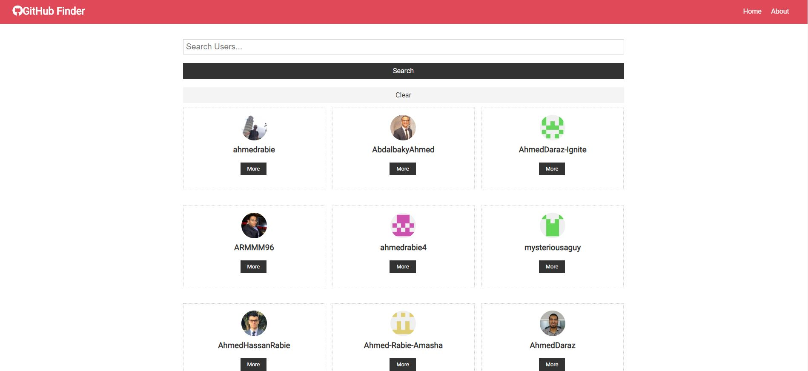

# About This app

    Just simple react app that fetches users data from github api

## How to use

    To run that app on your machine you will need to be aware that you will need to react environment to be configured and the official documentation will help out with that link:>> https://reactjs.org/docs/create-a-new-react-app.html

after configuring your environment all you need to do is to is to run in command on your terminal

```bash
yarn
```

then

```bash
yarn start
```

to run your dev server


